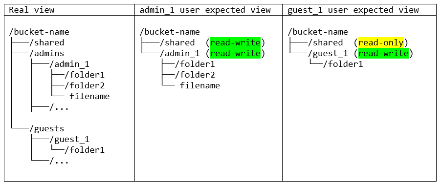

# SFTP-server using S3 and AWS Transfer Family

Let's assume you have S3 bucket and want to use it like safe FTP-server for users. 
Each user will have his own folder, and there will be shared folder, to which everyone has access.
For the sake of privacy and security, you do not want to give one user access files of other users,
but it is better to completely deprive them of the opportunity to see other people's folders.

For all these purposes, AWS Transfer Family is perfect.
The AWS Transfer Family provides fully managed support for file transfers over SFTP, FTPS, and FTP directly into and out of Amazon S3 and Amazon EFS. 
For users, the service supports commonly used SFTP clients such as WinSCP, FileZilla, and scripts.
And such a function as logical directory mappings will allow you to show the user only the folders allowed to him

In my example I use:
 * AWS Transfer Family server with `SFTP` protocol
 * S3 Bucket as storage
 * Two types of users: 
    * `admins` - with `read-write` access to the whole bucket
    * `guests` - with `read-only` access to shared folder, and `read-write` access to their own folders  
   
   
 * SSH-keys for connecting through FileZilla client


## Before you start

Requirements for working with AWS CDK:

 * AWS CLI
 * Node.js 14.x
 * python 3

Install CDK with command
```
npm install -g aws-cdk
```

In the root project directory:
 * Create virtual python enviroment
   ```
   > python -m venv .venv
   ```
 * Activate environment
   ```
   > source .venv/bin/activate
   ```
 * Install enviroment dependencies
   ```
   > pip install -r requirements.txt
   ```


To add additional dependencies, for example other CDK libraries, just add
them to your `setup.py` file and rerun the `pip install -r requirements.txt`
command.

## Useful commands
**Don't forget set up AWS Credentials and preferred region**


 * `cdk bootstrap aws://account_id/region` **(use only before first deploy in region)**  
 It creates bucket for temporary stack files storing
 * `cdk ls`          list all stacks in the app
 * `cdk synth`       emits the synthesized CloudFormation template
 * `cdk deploy`      deploy this stack to your default AWS account/region
 * `cdk diff`        compare deployed stack with current state
 * `cdk destroy`     delete this stack and all created infrastructure
 * `cdk docs`        open CDK documentation

## How to use
 * ### Don't forget activate environment 
   (described commands runs from root directory)
 * ### What's inside [config.py](aws_transfer_family/config.py) :
    * `bucket_name` - name of your S3 bucket
    * `class GroupNames` - fixed list of possible groups
    * `users` - description of storage users
   
 * ### Deploying
    * Run `cdk deploy`, await it's ending
    * Run `python update_bucket_structure.py`. It creates S3 bucket structure for your users
   

 * ### If you want to add another `NewGroup` :
    * Add new record into [class GroupNames](https://github.com/Wag-ON/AWS_Transfer_Family/blob/9e528cfef5d791d9e0318e59a0bc2c9b937c990c/aws_transfer_family/config.py#L4)
    * If necessary, define new IAM Policy Statements in [policy_statements.py](aws_transfer_family/policy_statements.py)
    * [Add creation of new IAM Role](https://github.com/Wag-ON/AWS_Transfer_Family/blob/9e528cfef5d791d9e0318e59a0bc2c9b937c990c/aws_transfer_family/aws_transfer_family_stack.py#L52) for this `NewGroup`
    * Add created Role to the [mapping](https://github.com/Wag-ON/AWS_Transfer_Family/blob/a6fe8343cfb238f7800dc739556f87b8c5355c04/aws_transfer_family/aws_transfer_family_stack.py#L61)
   
 * ### Add / Delete User
    * Just change [users](https://github.com/Wag-ON/AWS_Transfer_Family/blob/2a63dcd4102b8e22b809045762c8f83f263f0cc7/aws_transfer_family/config.py#L9)
      list as you wish
    * Make `Deploying` steps
   
 * ### SSH keys
   Pair (public/private) of keys are creating automatically and saving in `root/aws_transfer_family/secret_keys`  
   Deleting even one key from User's pair from this directory will lead to creating the new one pair and updating of User's `ssh public key` property

